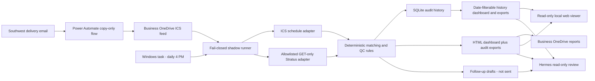

# Architecture

## Design Goals

1. Keep delivery decisions deterministic and testable.
2. Separate source adapters from business rules.
3. Preserve raw values and auditable evidence for every run.
4. Fail closed on missing, stale, ambiguous, or unknown data.
5. Prevent external writes during shadow evaluation.
6. Let Hermes explain completed reports without owning QC decisions.

## Components



The local model does not decide pass or fail. Python rules do. Hermes and Qwen can explain a
report, help locate an exception, and present an unsent draft, but they receive no Stratus or email
credentials for this workflow.

## Package Layout

```text
src/delivery_qc/
  adapters/        ICS, CSV, and GET-only Stratus readers
  application/     one-shot run orchestration
  domain/          normalized matching and deterministic QC rules
  infrastructure/  SQLite, HTML, audit export, and draft writers
  cli.py            operator entry point
config/             non-secret shadow configuration
docs/               architecture and operating policy
scripts/            daily runner and scheduled-task installer
tests/              unit and end-to-end tests
var/inbox/          copied runtime inputs
var/state/          SQLite audit database
var/reports/        completed review reports
var/drafts/         proposed, unsent follow-up messages
var/logs/           runner health and logs
```

## Decision Rules

- Include an event only when it explicitly identifies a manufactured Stratus package.
- Exclude unrelated meetings, pickups, tools, returns, and transfers.
- Match normalized package and project names first; use package-only matching only when unique.
- Pass only when all expected containers are `Field Received` and expected names/counts agree.
- Flag partial receipt, no receipt, unknown status, missing package, ambiguity, or mismatch.
- Always generate a report, including a zero-delivery report.
