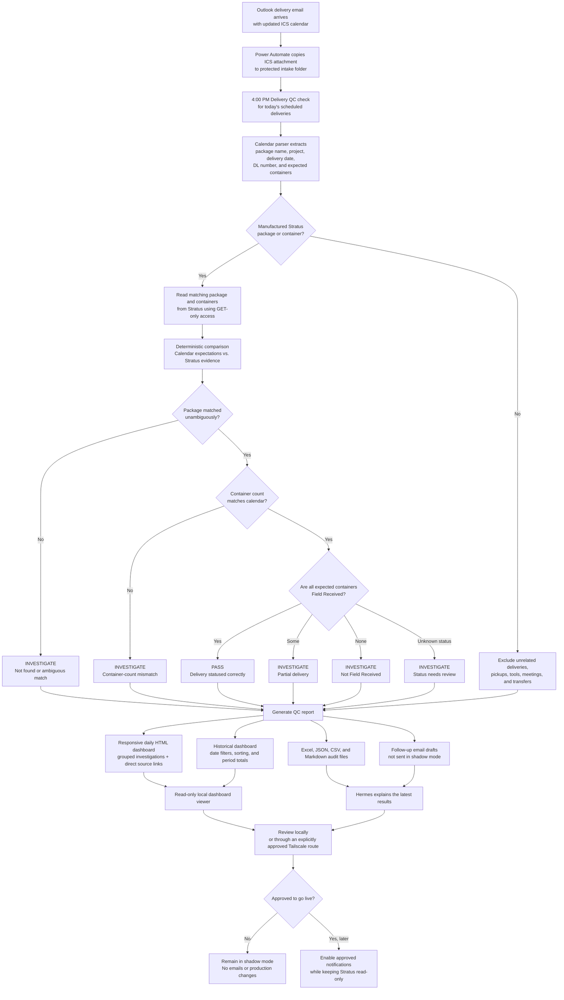

# Delivery QC Process Flowchart

## Key Control

Hermes and Qwen orchestrate and explain the report, but deterministic code decides
`PASS` or `INVESTIGATE`. Stratus remains read-only, and the process does not delete
or modify company data.
